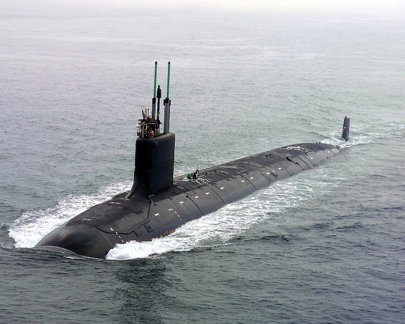

# Day 2: Dive

<br>
<small>_Image: Wikipedia_</small>

Today’s [problem](https://adventofcode.com/2021/day/2) solution uses projections to ingest the data, then a table to think through a solution to the second part. Finally we reduce the table solution to a simple vector expression.

## Ingestion

The text file consists of course adjustments that affect horizontal position and depth.

Download:
[`test2.txt`](./test/test2.txt)

```txt
forward 5
down 5
forward 8
up 3
down 8
forward 2
```

Question: **What do you get if you multiply your final horizontal position by your final depth?**

Take the starting position and depth as `0 0`. 
```q
q)forward:1 0*; down:0 1*; up:0 -1*
q)show c:value each read0`:test2.txt
5 0
0 5
8 0
0 -3
0 8
2 0
```

## Part 1

The final position and depth are simply the sum of `c` and the answer to part 1 is their product.
```q
q)prd sum c
150
```


## Part 2

[Part 2](https://adventofcode.com/2021/day/2#part2) complicates the picture. The first column of `c` still describes forward movements. But we now need to calculate ‘aim’. Up and Down now adjust aim, not depth. Depth changes by the product of forward motion and aim.

Question: **What do you get if you multiply your final horizontal position by your final depth?**

A table can help us to think this through.
```q
q)crs:{select cmd:x,fwd,ud from flip`fwd`ud!flip value each x}read0`:test2.txt
q)update aim:sums ud from `crs
`crs
q)update down:fwd*aim from `crs
`crs
q)show crs
cmd         fwd ud aim down
---------------------------
"forward 5" 5   0  0   0
"down 5"    0   5  5   0
"forward 8" 8   0  5   40
"up 3"      0   -3 2   0
"down 8"    0   8  10  0
"forward 2" 2   0  10  20
```
Now we have the changes in horizontal and vertical position ``crs[`fwd`down]`` and can simply sum for the final position.
```q
q)sum each crs[`fwd`down]
15 60
```
But the `down` column is no more than the product of the `fwd` column and the accumulated sums of the `ud` column. 
We can express the whole thing in terms of the `fwd` and `ud` vectors.
```q
q)`fwd:`ud set'flip c  / forward; up-down
q)prd sum each(fwd;fwd*sums ud)
900
```
The repetition of `fwd` catches the eye. 
Isn’t `(fwd;fwd*sums ud)` just `fwd` multiplied by 1 and by `sums ud`?
```q
q)prd sum fwd*1,'sums ud
900
```
Or expressed as a function directly on the columns of `c`
```q
q)prd sum {x*1,'sums y}. flip c
```

## Solution

Download:
[`day2.txt`](./data/day2.txt)

```q
forward:1 0*; down:0 1*; up:0 -1*
c:value each read0`:day2.txt
a[`$"2-2"]:prd sum c
a[`$"2-2"]:prd sum {x*1,'sums y}. flip c
```
The table operations were a helpful way to visualize the elements of the problem. On study, they refactored to a much simpler vector solution. 


---
==>
[Day 3: Binary Diagnostic](./03-binary-diagnostic.md)